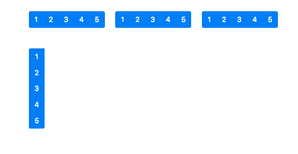

# Inicio Curso Bootstrap 4

## ¿Que es Bootstrap?

Bootstrap es un kit de herramientas de código abierto para desarrollar con HTML, CSS y JS. Haga un prototipo rápido de sus ideas o cree su aplicación completa con nuestras variables y mixins de Sass, sistema de cuadrícula sensible, componentes precompilados extensos y potentes complementos basados ​​en jQuery.

[Ir a Expo Bootstrap](http://expo.getbootstrap.com/ "Ir a Expo Bootstrap")

## Primeros Pasos

1. Descargar Bootstrap (Compiled CSS and JS)
2. Agregar el meta:vp
3. Agregar CSS de Bootstrap
4. Descargar Jquery e insertar al final del body (min)
5. Insertar Jquery de Bootstrap (min)

## Grid de Bootstrap

1. div.container
2. div.row
3. div.col (Determina tamaño automático según elementos)
4. div.col-12 (Determina tamaño extra pequeño)

~~~
	.col      Extra pequeño (Extra Small) - Smartphone Vertical  Menos de 544px
	.col-sm   Pequeño (Small)  - Smartphones Verticales          Más de 544px y Menos de 768px
	.col-md   Mediano (Medium) - Tablets			     Más de 768px y Menos de 992px
	.col-lg   Largo (Large) - Computadoras			     Más de 992px y Menos de 1200px
	.col-xl   Extra Largo (Extra Large) - Computadoras	     Más de 1200px
~~~

5. div.col-auto (Utiliza solo el espacio que necesita si se combina con div.col)
6. div.col-sm-auto (Se puede combinar con los tamaños de dispositivos)
7. div.w-100 (Crea una fila rapida)

## Alinear verticalmente

### estilos previos

~~~
	
~~~

### Alinear Filas

1. div.row align-items-start  (alinear al principio toda la fila)
2. div.row align-items-center (alinear al centro toda la fila)
3. div.row align-items-end    (alinear al final toda la fila)

### Alineación independiente

1. div.col align-self-start   (Alinear columna al principio)
2. div.col align-self-center  (Alinear columna al centro)
3. div.col align-self-end     (Alinear columna al final)

### Alineado Horizontal

1. Solo funciona para div.row
2. div.row justify-content-start   (Alinear Fila al princio)
3. div.row justify-content-center  (Alinear Fila al centro)
4. div.row justify-content-end     (Alinear Fila al final)
5. div.row justify-content-around  (Alinear Fila al rededor)
6. div.row justify-content-between (Alinear Fila entre espacios)

## Offseting

1. div.offset-2
2. div.offset-lg-4 (Centrar en dispositivo Largos, similar a justify-content-center)
3. div.offset-lg-0 (Reinicia offset)

## Reodenar columnas

- Indicar que columnas van primero y cuales despues sin tocar el HTML

1. div.row justify-content-between
2. div.flex-first
3. div.flex-last
4. div.flex-unordered

## Ocultar elementos

Existen elementos que ya no son compatibles con V4 Alpha
como por ejemplo .hidden-xs-down

[Nuevos Hidden](https://getbootstrap.com/docs/4.0/utilities/display/ "Nuevos Hidden")

1. div.col d-none d-sm-block (SM - Small)
2. div.col d-none d-md-block (MD - Medium)
3. div.col d-none d-lg-block (LG - Large)
4. div.col d-none d-xl-block (XL - Extra Large)

## Tipografia

1. small.text-muted (Textos mas suaves)
2. p.h1             (Parrafo con estilo de h1)
3. h1.display-1     (Encabezado con letras mas delgadas 1-4)
4. p.lead           (Parrafo resaltado)

## Tipografia 2 tag

- mark   (Texto Destacado)
- del    (Texto Tachado)
- s	   (Texto Tachado)
- ins    (Texto Subrayado)
- u	   (Texto Subrayado)
- strong (Texto en negritas)
- small  (Texto mas pequeño)
- em     (Texto en italic)

p.text-justify			(Texto Justificado)
div.card>div.card-block (Crear cartas)

### Alinear Textos

1. p.text-left     (Texto alineado a la izquierda)
2. p.text-center   (Texto centrado)
3. p.text-right    (Texto alineado a la derecha)

4. p.text-left text-sm-right (Texto sm alineado a la derecha)
5. p.text-left text-md-right (Texto md alineado a la derecha)
6. p.text-left text-lg-right (Texto lg alineado a la derecha)
7. p.text-left text-xl-right (Texto xl alineado a la derecha)

8. p.text-lowercase font-weight-bold   (Minusculas y negritas)
9. p.text-uppercase font-weight-normal (Mayusculas y normal)
10. p.text-capitalize font-italic      (Letras capitales e italic)

## Boques de codigo

~~~
<pre><code>&lt;h1&gt;Lorem ipsum dolor sit amet.&lt;/h1&gt;</code></pre>
~~~

la etiqueta kbd permite agregar atajos de teclas

Para copiar texto Presiona <kbd>Ctrl + C </kbd>

## Imagenes

#### lorempixel
http://lorempixel.com/200/200

1. img-fluid     (Imagen se adapta al contenedor)
2. rounded       (Esquinas redondeadas)
3. img-thumbnail (Imagenes con border blancos)
4. float-left    (Imagen flotante a la izquierda)
5. float-right   (Imagen flotante a la derecha)

#### tag para imagenes

1. figure.figure  			 (Crear cuadro de figura)
2. img.img-fluid rounded 	 (Crear imagen responsiva)	
3. figcaption.figure-caption  (Crear Mensaje en pie de img)
4. p.text-center">Lorem ipsum (Centrar texto de pie de img)

## Tablas

1. table.table          (Modo tabla)
2. table.table-striped  (Sombreado a elementos pares)
3. table.table-bordered (Tabla con bordes)
4. table.table-hover    (Tabla marcada cuando se pasa el mouse)
5. table.dark 			(Similar a inverse)
6. table.thead-dark     (Similar a inverse pero para encabezados)

### Colores

1.  tr.table-primary (Color azul claro)
2.  tr.table-success (Color verde claro)
3.  tr.table-warning (Color naranja claro)
4.  tr.table-danger  (Color rojo claro)
5.  tr.table-info    (Color celeste claro)
6.  tr.bg-primary    (Color azul oscuro)
7.  tr.bg-success    (Color verde oscuro)
8.  tr.bg-warning    (Color naranja oscuro)
9.  tr.bg-danger     (Color rojo oscuro)
10. tr.bg-info       (Color celeste oscuro)

## Media Object

- div.media
- img.d-flex align-self-start mr-3
- div.media-body
- h4.mt-0
- hr

## Alertas

1. div.alert alert-success mt-3
2. div.alert alert-info mt-3
3. div.alert alert-warning mt-3
4. div.alert alert-danger mt-3
5. a.alert-link   (Colores a los links)

### Boton de cerrado

~~~

	Lorem ipsum dolor sit amet.
	<button type="button" class="close" data-dismiss="alert" aria-label="cerrar">
		&times;
	</button>

~~~

## Insignias

1. h1>span.badge badge-secondary
2. h2>span.badge badge-danger
3. h3>span.badge badge-warning
4. h4>span.badge badge-info
5. h5>span.badge badge-primary
6. h6>span.badge badge-success
7. h1>span.badge badge-pill badge-secondary  ("Forma redondeada")

## Botones

1.  button.btn btn-primary
2.  button.btn btn-secondary
3.  button.btn btn-success
4.  button.btn btn-info
5.  button.btn btn-warning
6.  button.btn btn-danger
7.  button.btn btn-link
8.  button.btn btn-outline-primary (Outline Button)
9.  button.btn btn-lg btn-primary  (Large Button)
10. button.btn btn-sm btn-primary  (Small Button)
11. button.btn btn-lg btn-block btn-primary (Block Button)

~~~
<h2>Checkbox</h2>

		<label class="btn btn-primary">
			<input type="checkbox" name="" id=""> Checkbox 1
		</label>

<h2>Radio</h2>

	<label class="btn btn-primary">
	<input type="radio" name="sexo" id=""> Hombre

	<label class="btn btn-secondary active">
		<input type="checkbox" checked autocomplete="off"> Checked
	</label>

~~~

## Grupos de botones

1. div.btn-toolbar (Agrupar grupos)
2. div.btn-group   (Agrupar botones)

~~~
	

		<button class="btn btn-primary">1</button>
		<button class="btn btn-primary">2</button>
		<button class="btn btn-primary">3</button>
		<button class="btn btn-primary">4</button>
		<button class="btn btn-primary">5</button>
	

~~~

## Cards

1. div.card  	   (Iniciar card)
2. div.card-header (Cabecera del card)
3. div.card-body   (Cuerpo del card - similar a block)
4. h1.card-title   (Titulo del contenido)
5. p.card-subtitle mb-2 text-muted (Subtitulo)
6. p.card-text     (Texto de la carta)
7. a.card-link     (Estilo especial para enlaces)
8. div.card-footer (Pie de pagina)

### estilos especiales de card

~~~

~~~

### Card group

- div.card-group (Permite juntar las card y dejarlas sin bordes)

## Carousel

## Collapse

## Dropdown

## Formularios

- div.form-group (Clase padre que agrupa los contenidos)
- input.form-control (Agrupa inputs)

### Texto de ayuda
~~~
<small class="form-text text-muted">Lorem ipsum dolor sit amet, consectetur adipisicing elit. Quasi, incidunt.</small>
~~~

### checkbox y radio (Se utilizan las ismas clases)

~~~

	
		
		<label for="mujer" class="form-check-label" for="">
			<input type="radio" name="sexo" id="mujer" class="form-check-input mr-2">Mujer
		</label>
	

	
~~~

### Para formularios en linea

~~~
<form action="" class="form-inline">
~~~

### 

~~~

	

		<h4>Checkbox inline</h4>
		

			<label class="form-check-label" for="opcion11">
				<input type="checkbox" name="" id="opcion11" value="opcion1">Opción 1
			</label>	
		

		

			<label class="form-check-label" for="opcion12">
				<input type="checkbox" name="" id="opcion12" value="opcion1">Opción 2
			</label>	
		

	

~~~

div.form-check-inline (Agrupa en linea los elemetos check y radio)

### bordes de colores

- En versiones 4 alpha se podia cambiar el color del border con:

div.form-group has-danger (Borde de color rojo)

## Jumbotron

- div.jumbotron mt-3
- h1.display-3 mb-3
- p.lead

## Grupo Listas

### Para Listas

- ul.list-group
- li.list-group-item           (Elemento)
- li.list-group-item disabled  (Item desactivado)
- li.list-group-item active    (Item Activo)
- li.list-group-item list-group-item-success (Elemento de color verde)

### Para Enlaces

- div.list-group
- a.list-group-item list-group-item-action
- a.list-group-item list-group-item-action active
- a.list-group-item list-group-item-success

## Modal

### Boton

~~~
<button class="btn btn-danger" data-toggle="modal"
	data-target="#fm-modal-grid">Abrir modal con grid
</button>
~~~

### Estructura

~~~

	

		

			

				<h5 class="modal-title" id="">Titulo de la ventana con grid</h5>
				<button class="close" data-dismiss="modal" aria-label="cerrar">&times;</button>
			

			

				

					

						

							
Lorem ipsum dolor sit amet, consectetur adipisicing elit. Veritatis, eaque.

						

						

							
Lorem ipsum dolor sit amet, consectetur adipisicing elit. Veritatis, eaque.

						

					

				

			

			

				<button class="btn btn-success">Aceptar</button>
				<button data-dismiss="modal" class="btn btn-secondary">Cerrar</button>
			

		

	
	

~~~

### Navs

### nav simple

- ul.nav
- li.nav-item>a.nav-link
- li.nav-item>a.nav-link disabled

### Con tag nav

- nav.nav
- a.nav-link

### etiquetas adicionales

- nav.nav justify-content-center (Centrado)
- nav.nav flex-column bg-dark    (Modo vertical)

### Sujerencia de estilos

~~~

~~~

## Paneles

- ul.nav nav-tabs
- li>a.nav-link active
- li>a.nav-link disabled

- ul.nav nav-pills (Forma de pildora)
- ul.nav nav-pills nav-fill (Ocupa el 100%)

### Dropdown

~~~

	<h1 class="text-center">Tabs</h1>
	<ul class="nav nav-pills nav-fill">
<li class="nav-item">
	<a href="" class="nav-link active dropdown-toggle" data-toggle="dropdown" role="button" aria-haspopup="true" aria-expanded="false">Inicio</a>
		

			<a href="#" class="dropdown-item">Categoria 1</a>
			<a href="#" class="dropdown-item">Categoria 2</a>
			<a href="#" class="dropdown-item">Categoria 3</a>
		

</li>
<li class="nav-item"><a href="" class="nav-link disabled">Blog</a></li>

~~~

### tabs

ul.nav nav-tabs

- Elementos links:
~~~
	<li class="nav-item">
		<a href="#tab1" class="nav-link active" data-toggle="tab">Tab 1</a>
	</li>
~~~

- Contenido

	

		<h3>Panel 1</h3>
		
Lorem ipsum dolor sit amet, consectetur adipisicing elit. A ducimus iste sint rerum voluptatibus, inventore 			commodi, amet autem ipsum. Reprehenderit est, quo ad molestiae adipisci dolores ullam minus eius aperiam.

	

	

## navbar

## Paginación

- nav>ul.pagination
~~~
<li class="page-item disabled">
	<a href="">&laquo; Anterior
	</a>
</li>
~~~

- li.page-ite>a.page-link{1}

~~~
<li class="page-item">
	<a class="page-link" href="">
		Siguiente &raquo;
	</a>
</li>
~~~

- ul.d-flex justify-content-start
