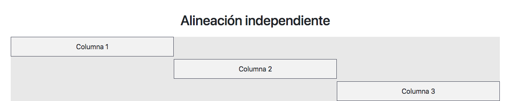

# Inicio Curso Bootstrap 4

## ¿Que es Bootstrap?

Bootstrap es un kit de herramientas de código abierto para desarrollar con HTML, CSS y JS. Haga un prototipo rápido de sus ideas o cree su aplicación completa con nuestras variables y mixins de Sass, sistema de cuadrícula sensible, componentes precompilados extensos y potentes complementos basados ​​en jQuery.

[Ir a Expo Bootstrap](http://expo.getbootstrap.com/ "Ir a Expo Bootstrap")

## Primeros Pasos

1. Descargar Bootstrap (Compiled CSS and JS)
2. Agregar el meta:vp
3. Agregar CSS de Bootstrap
4. Descargar Jquery e insertar al final del body (min)
5. Insertar Jquery de Bootstrap (min)

## Grid de Bootstrap

1. div.container
2. div.row
3. div.col (Determina tamaño automático según elementos)
4. div.col-12 (Determina tamaño extra pequeño)

~~~
	.col      Extra pequeño (Extra Small) - Smartphone Vertical  Menos de 544px
	.col-sm   Pequeño (Small)  - Smartphones Verticales          Más de 544px y Menos de 768px
	.col-md   Mediano (Medium) - Tablets			     Más de 768px y Menos de 992px
	.col-lg   Largo (Large) - Computadoras			     Más de 992px y Menos de 1200px
	.col-xl   Extra Largo (Extra Large) - Computadoras	     Más de 1200px
~~~

5. div.col-auto (Utiliza solo el espacio que necesita si se combina con div.col)
6. div.col-sm-auto (Se puede combinar con los tamaños de dispositivos)
7. div.w-100 (Crea una fila rapida)

## Alinear verticalmente

### estilos previos

~~~
	
~~~

### Alinear Filas

1. div.row align-items-start  (alinear al principio toda la fila)
2. div.row align-items-center (alinear al centro toda la fila)
3. div.row align-items-end    (alinear al final toda la fila)

### Alineación independiente

1. div.col align-self-start   (Alinear columna al principio)
2. div.col align-self-center  (Alinear columna al centro)
3. div.col align-self-end     (Alinear columna al final)

### Alineado Horizontal

1. Solo funciona para div.row
2. div.row justify-content-start   (Alinear Fila al princio)
3. div.row justify-content-center  (Alinear Fila al centro)
4. div.row justify-content-end     (Alinear Fila al final)
5. div.row justify-content-around  (Alinear Fila al rededor)
6. div.row justify-content-between (Alinear Fila entre espacios)

## Offseting

1. div.offset-2
2. div.offset-lg-4 (Centrar en dispositivo Largos, similar a justify-content-center)
3. div.offset-lg-0 (Reinicia offset)

